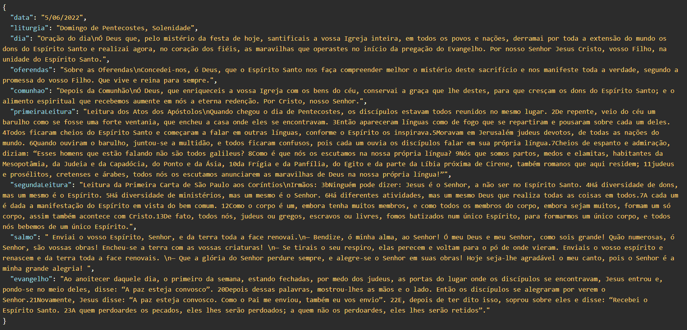

# liturgia-diaria
API que fornece as orações e leituras do dia da Santa Missa (liturgia dária).
> Acesse pelo link: https://liturgiatododia.herokuapp.com/  
> 
> Caso deseje ir a um dia específico, https://liturgiatododia.herokuapp.com/[dia]-[mês]  
> (O dia sem o 0 caso seja menor que 10)

> Ou:
> https://liturgiatododia.herokuapp.com/?dia=[dia]&mes=[mês]  
> Caso o mês não seja definido, o padrão será o mês atual.
---

